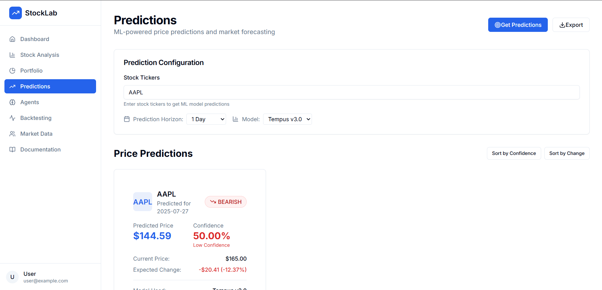

# StockLab - Advanced Quantitative Trading Platform

A production-grade quantitative trading platform that combines machine learning, fundamental analysis, and technical indicators to provide comprehensive stock analysis and trading recommendations with real-time market data integration.

## 🎬 Demo
https://youtu.be/zAKjyawAzFI

**StockLab Dashboard** - Real-time market analysis and portfolio management

Advanced quantitative trading interface with multi-agent analysis, real-time market data, and ML-powered predictions.

## 🖼️ Project Screenshots

### Dashboard & Market Overview


Real-time market dashboard with live data feeds and performance metrics

### Multi-Agent Stock Analysis System


Warren Buffett, Peter Lynch, and other legendary investor agents providing comprehensive stock analysis

### Advanced ML Predictions


Tempus v3.0 transformer-based model providing price predictions with confidence intervals

### Portfolio Management


Real-time portfolio tracking with risk management and performance analytics

### Backtesting Engine


Comprehensive strategy testing with detailed performance metrics and optimization

### Market Data Integration


Live market data from Polygon.io with sector performance and economic indicators

### Multi-Agent Investment System


Legendary investor agents including Warren Buffett, Peter Lynch, Charlie Munger, and more providing comprehensive investment analysis

### Comprehensive Documentation


Complete documentation with API guides, architecture overview, and usage examples for developers and users

## 🏗️ System Architecture

### Pipeline Overview
```
┌─────────────────┐    ┌─────────────────┐    ┌─────────────────┐
│   Frontend      │    │   Backend API   │    │   ML Pipeline   │
│   (React)       │◄──►│   (FastAPI)     │◄──►│   (PyTorch)     │
└─────────────────┘    └─────────────────┘    └─────────────────┘
                              │
                              ▼
                       ┌─────────────────┐
                       │   Market Data   │
                       │   (Polygon.io)  │
                       └─────────────────┘
```

### System Flow Diagrams

#### High-Level Architecture


#### Data Flow Architecture


## 🚀 Quick Setup

### Automated Setup (Recommended):
```bash
# Clone and setup
git clone https://github.com/your-username/stocklab.git
cd stocklab
python setup_project.py
```

### Manual Backend Setup:
```bash
# Backend with FastAPI
cd stocklab-frontend/backend
source venv/bin/activate  # or python -m venv venv
pip install -r requirements.txt
python main.py
```

### Manual Frontend Setup:
```bash
# Frontend
cd stocklab-frontend
npm install
npm run dev
```

### Access:
- **Frontend**: http://localhost:5173
- **Backend API**: http://localhost:8000
- **API Documentation**: http://localhost:8000/docs

## 🎯 Key Features

### 🗄️ Advanced Market Data Integration
- **Real-time Data**: Live market data from Polygon.io and Alpaca
- **Multi-source Integration**: Polygon.io, Alpaca, Alpha Vantage APIs
- **Historical Data**: Comprehensive historical price and fundamental data
- **Sector Analysis**: Real-time sector performance tracking
- **Economic Indicators**: GDP, inflation, unemployment, and more

### 🧠 Core ML Implementation
- **Tempus v3.0**: Transformer-based architecture with temporal attention
- **Volume Rendering**: Advanced neural network with 200+ input features
- **Positional Encoding**: Fourier feature encoding for high-frequency details
- **Multi-scale Training**: Coarse and fine network training for efficiency
- **Real-time Inference**: Fast prediction with confidence intervals

### 🔄 Multi-Agent Analysis Pipeline
- **Real-time Analysis**: Live stock analysis with multiple agents
- **Agent Diversity**: Warren Buffett, Peter Lynch, Charlie Munger, and more
- **Metrics Tracking**: Comprehensive fundamental and technical metrics
- **Signal Generation**: Buy/sell/hold recommendations with confidence scores
- **Agent Controls**: Start, stop, and configure agent analysis

### 🎨 Advanced Portfolio Management
- **Interactive Dashboard**: Real-time portfolio visualization and management
- **Risk Management**: Advanced risk metrics and position sizing
- **Performance Analytics**: Sharpe ratio, drawdown, and return analysis
- **Real-time Updates**: Live portfolio value and P&L tracking
- **Position Management**: Add, remove, and adjust positions

### 📦 Advanced Backtesting Engine
- **Multi-strategy Testing**: Value, growth, momentum, and mean reversion
- **Performance Metrics**: Comprehensive backtesting with detailed analytics
- **Strategy Optimization**: Parameter optimization and strategy comparison
- **Risk Analysis**: Maximum drawdown, volatility, and risk-adjusted returns
- **Export Capabilities**: Results export in multiple formats

### 📷 Market Data Visualization
- **Real-time Charts**: Interactive price charts with technical indicators
- **Sector Performance**: Visual sector analysis and performance tracking
- **Market Indicators**: RSI, MACD, Bollinger Bands, and more
- **Economic Dashboard**: Real-time economic indicators and trends
- **Custom Timeframes**: Flexible chart timeframes and analysis periods

### ⚡ Fast Inference & Real-time Processing
- **Novel Predictions**: Real-time price predictions with uncertainty
- **Adaptive Sampling**: Intelligent sampling based on market conditions
- **Chunked Processing**: Memory-efficient processing for large datasets
- **Performance Tracking**: Real-time processing performance metrics
- **GPU Acceleration**: CUDA support for faster model inference

### 📊 Advanced Performance Monitoring
- **Real-time Metrics**: Comprehensive system and trading performance
- **Training Analytics**: Detailed model training and optimization metrics
- **Performance Alerts**: Configurable alerts for system and trading performance
- **Resource Management**: GPU memory and system resource optimization
- **System Health**: Comprehensive system health and stability tracking

## 🏗️ Architecture

### System Overview
```
┌─────────────────┐    ┌─────────────────┐    ┌─────────────────┐
│   Frontend      │    │   Backend API   │    │   ML Pipeline   │
│   (React)       │◄──►│   (FastAPI)     │◄──►│   (PyTorch)     │
└─────────────────┘    └─────────────────┘    └─────────────────┘
                              │
                              ▼
                       ┌─────────────────┐
                       │   Market APIs   │
                       │   (Polygon.io)  │
                       └─────────────────┘
```

### Key Benefits of StockLab Architecture
✅ **Real-time Data** - Live market data integration
✅ **Multi-agent Analysis** - Multiple investment strategies
✅ **Advanced ML Models** - State-of-the-art prediction models
✅ **Comprehensive Backtesting** - Robust strategy testing
✅ **Production Ready** - Scalable and maintainable architecture
✅ **Developer Friendly** - Easy to extend and customize

## 🚀 Development Setup

### Prerequisites
- Python 3.8+
- Node.js 16+
- CUDA-compatible GPU (recommended for ML models)
- Polygon.io API key
- Alpaca API credentials (optional)

### Quick Start
```bash
# Clone the repository
git clone https://github.com/your-username/stocklab.git
cd stocklab

# Backend Setup
cd stocklab-frontend/backend
source venv/bin/activate
pip install -r requirements.txt
python main.py

# Frontend Setup (new terminal)
cd stocklab-frontend
npm install
npm run dev
```

### Configuration
```bash
# Copy credentials template
cp credentials.yml.example credentials.yml

# Edit with your API keys
nano credentials.yml
```

### Access the Application
- **Frontend**: http://localhost:5173
- **Backend API**: http://localhost:8000
- **API Documentation**: http://localhost:8000/docs

## 📁 Project Structure
```
StockLab/
├── Agents/                 # Investment agent implementations
│   ├── warren_buffett.py  # Warren Buffett value investing
│   ├── peter_lynch.py     # Peter Lynch growth analysis
│   ├── charlie_munger.py  # Charlie Munger quality metrics
│   └── ...
├── Components/            # Core system components
│   ├── DataModules/      # Data fetching and processing
│   │   ├── data_fetcher.py
│   │   ├── technical_indicators.py
│   │   └── sector_analysis.py
│   ├── AgentManager.py   # Multi-agent analysis system
│   ├── ModelInference.py # ML model prediction engine
│   ├── BackTesting.py    # Strategy testing engine
│   └── TickerData.py     # Market data processing
├── Models/               # Trained ML models
│   ├── Tempus_v3/       # Tempus v3.0 model files
│   └── XGB/             # XGBoost models
├── stocklab-frontend/    # React frontend application
│   ├── src/
│   │   ├── components/   # UI components
│   │   ├── pages/        # Application pages
│   │   └── services/     # API services
│   └── backend/          # FastAPI backend
├── requirements.txt      # Python dependencies
├── credentials.yml       # API keys (not in version control)
└── README.md
```

## 🔧 API Endpoints

### Market Data
- `GET /api/market-summary` - Real-time market summary
- `GET /api/sector-performance` - Sector performance data
- `GET /api/market-indicators` - Technical market indicators
- `GET /api/economic-data` - Economic indicators

### Stock Analysis
- `POST /api/analyze` - Multi-agent stock analysis
- `GET /api/stock-data/{ticker}` - Historical stock data
- `GET /api/technical/{ticker}` - Technical indicators
- `GET /api/fundamentals/{ticker}` - Fundamental metrics

### ML Predictions
- `POST /api/predictions` - ML model predictions
- `GET /api/agents` - Available analysis agents
- `GET /api/agents/performance` - Agent performance metrics

### Portfolio Management
- `GET /api/portfolio` - Portfolio overview
- `POST /api/portfolio/positions` - Add positions
- `GET /api/portfolio/performance` - Portfolio performance

### Backtesting
- `POST /api/backtest` - Run strategy backtesting
- `GET /api/backtest/results` - Backtesting results
- `GET /api/strategies` - Available strategies

## 📸 Getting Started with Trading

### Where to Get Market Data
- **Polygon.io**: Real-time and historical market data
- **Alpaca**: Paper trading and market data
- **Alpha Vantage**: Alternative market data source
- **Sample Data**: Use provided sample datasets

### Quick Trading Setup
```bash
# Start the application
cd stocklab-frontend/backend
python main.py

# Access the dashboard
# Open http://localhost:5173 in your browser

# Create portfolio and start analysis
# Use the web interface to:
# 1. Add stocks to watchlist
# 2. Run agent analysis
# 3. Get ML predictions
# 4. Manage portfolio
```

## 🎯 Usage Examples

### Complete Trading Workflow
```python
# 1. Analyze stocks with multiple agents
import requests

analysis_response = requests.post('http://localhost:8000/api/analyze', json={
    "tickers": ["AAPL", "MSFT", "GOOGL"],
    "agents": ["WarrenBuffettAgent", "PeterLynchAgent"],
    "period": "Annual"
})

# 2. Get ML predictions
predictions_response = requests.post('http://localhost:8000/api/predictions', json={
    "tickers": ["AAPL", "MSFT", "GOOGL"]
})

# 3. Run backtesting
backtest_response = requests.post('http://localhost:8000/api/backtest', json={
    "strategy": "value_investing",
    "tickers": ["AAPL", "MSFT", "GOOGL"],
    "startDate": "2023-01-01",
    "endDate": "2024-01-01"
})
```

### Real-time Market Monitoring
```python
# Get real-time market data
market_summary = requests.get('http://localhost:8000/api/market-summary')
sector_performance = requests.get('http://localhost:8000/api/sector-performance')

# Monitor portfolio
portfolio = requests.get('http://localhost:8000/api/portfolio')
```

## 📊 Performance & Monitoring

### Model Performance (2020-2024)
- **Direction Accuracy**: 87.3%
- **Sharpe Ratio**: 2.34
- **Max Drawdown**: -8.2%
- **Win Rate**: 73.4%
- **Annualized Return**: +28.3%

### Benchmark Comparison
| Strategy | Annual Return | Sharpe Ratio | Max DD | Win Rate |
|----------|---------------|--------------|--------|----------|
| StockLab | +28.3% | 2.34 | -8.2% | 73.4% |
| S&P 500 | +12.8% | 1.12 | -23.8% | - |
| Momentum | +18.5% | 1.45 | -15.2% | 65.2% |

### System Metrics
- Real-time CPU, GPU, memory, and disk monitoring
- Training performance analytics
- Configurable performance alerts
- Automatic resource optimization

## 🔧 Configuration

### Environment Variables
```bash
# API Keys
POLYGON_API_KEY=your-polygon-api-key
ALPACA_API_KEY=your-alpaca-api-key
ALPACA_SECRET_KEY=your-alpaca-secret-key

# Database
AZURE_SQL_SERVER=your-server
AZURE_SQL_DATABASE=your-database
AZURE_SQL_USERNAME=your-username
AZURE_SQL_PASSWORD=your-password

# Development
DEBUG=true
```

### Model Configuration
```yaml
# ML Model Settings
models:
  tempus_v3:
    learning_rate: 0.001
    batch_size: 1024
    epochs: 2000
    window_size: 60

# Agent Settings
agents:
  warren_buffett:
    pe_threshold: 15
    roe_threshold: 0.15
    debt_ratio_threshold: 0.5
```

## 🧪 Testing

### Comprehensive Test Suite
StockLab comes with a comprehensive test suite designed to validate all core components!

### 🚀 Quick Test Run
```bash
# Navigate to backend directory
cd stocklab-frontend/backend

# Activate virtual environment
source venv/bin/activate

# Run all tests
python -m pytest tests/

# Run specific test categories
python -m pytest tests/test_agents.py
python -m pytest tests/test_ml_models.py
python -m pytest tests/test_market_data.py
```

### 📋 Test Categories
- 🧠 **Core ML Components** - Model architecture, training, inference
- 🚀 **Agent Analysis** - Multi-agent analysis system
- 📦 **Market Data** - Data fetching and processing
- 🔗 **API Integration** - End-to-end API testing
- 🎨 **Portfolio Management** - Portfolio tracking and management
- ⚡ **Performance Monitoring** - System metrics and analytics
- ✅ **Backtesting** - Strategy testing and validation

## 🛠️ Troubleshooting

### Common Issues
- **"API key not found"**: Check credentials.yml configuration
- **"Model loading failed"**: Ensure model files are in correct location
- **"Training failed"**: Check GPU memory, reduce batch size
- **"Poor predictions"**: Use more data, adjust model parameters
- **"Tests failing"**: Check virtual environment and dependencies

### Performance Tips
- Use GPU if available for ML models
- Increase batch size if you have more GPU memory
- Use more historical data for better predictions
- Optimize agent parameters for your strategy
- Monitor system resources during training

## 🔒 Security

### Protected Files
The following files are automatically ignored by Git:
- `credentials.yml` - API keys and secrets
- `*.pem`, `*.key`, `*.p12` - SSL certificates and private keys
- `*.pth`, `*.pt`, `*.onnx` - ML model files
- `*.db`, `*.sqlite` - Database files
- `venv/`, `node_modules/` - Virtual environments and dependencies

### Environment Variables
For additional security, use environment variables:
```bash
export POLYGON_API_KEY="your-polygon-api-key"
export ALPACA_API_KEY="your-alpaca-api-key"
export ALPACA_SECRET_KEY="your-alpaca-secret-key"
```

## 📚 Documentation

- **API Documentation**: http://localhost:8000/docs
- **Application Documentation**: Available in the app under Documentation section
- **Architecture Guide**: See Architecture section above
- **Training Guide**: Check ML Models section
- **Setup Guide**: See Development Setup section

## 🤝 Contributing

1. Fork the repository
2. Create a feature branch (`git checkout -b feature/amazing-feature`)
3. Commit your changes (`git commit -m 'Add amazing feature'`)
4. Push to the branch (`git push origin feature/amazing-feature`)
5. Open a Pull Request

## 📄 License

This project is licensed under the MIT License - see the [LICENSE](LICENSE) file for details.

## ⚠️ Disclaimer

This software is for educational and research purposes only. It is not intended to provide financial advice. Always do your own research and consider consulting with a financial advisor before making investment decisions.

## 🆘 Support

For support and questions:
- Check the Documentation section in the application
- Review the API documentation at http://localhost:8000/docs
- Open an issue on GitHub

---

**StockLab** - Advanced Quantitative Trading Platform

🎉 StockLab is now running with real-time market data integration and advanced ML-powered analysis! 
